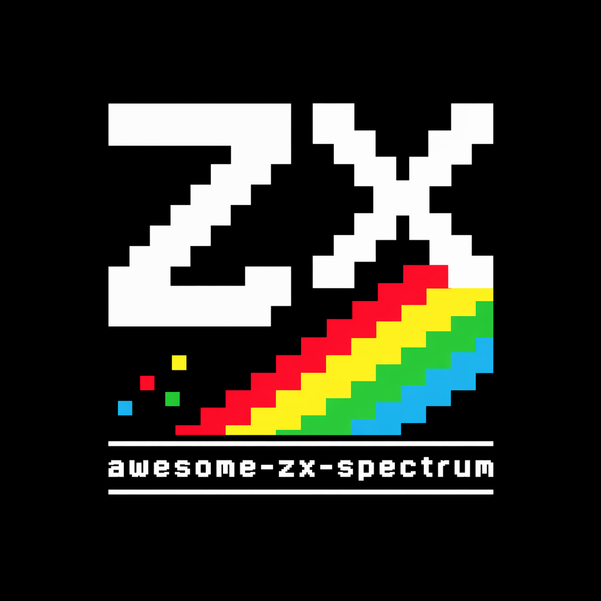

# Awesome ZX Spectrum

Language: **English** | [Português (Brasil)](README.pt-BR.md)

A curated list of high-quality ZX Spectrum resources for playing, building, studying,
preserving, and enjoying the Speccy.

This list collects strong ZX Spectrum resources across archives, emulators,
development tools, reverse engineering references, art, documentation, and
community hubs. It also includes notable Brazilian TK90X/TK95 resources where
they are especially useful. The goal is quality over quantity.

## Contents

- [Awesome ZX Spectrum](#awesome-zx-spectrum)
  - [Contents](#contents)
  - [Archives and discovery](#archives-and-discovery)
  - [Emulators](#emulators)
  - [Development tools](#development-tools)
  - [Reverse engineering and technical docs](#reverse-engineering-and-technical-docs)
  - [Art, music, and demos](#art-music-and-demos)
  - [Reviews, magazines, and history](#reviews-magazines-and-history)
  - [Brazil and TK90X survey](#brazil-and-tk90x-survey)
  - [Communities and reference sites](#communities-and-reference-sites)
  - [Modern Spectrum-related platforms](#modern-spectrum-related-platforms)
  - [What this list tries to be](#what-this-list-tries-to-be)
  - [What this list avoids](#what-this-list-avoids)
  - [Contributing](#contributing)
  - [License](#license)

## Archives and discovery

These resources help you find software, metadata, and archival records. They are
strong starting points for both browsing and deep research.

- [CompilationZX](https://compilationzx.com/) - Archive and editorial site focused on ZX Spectrum game compilations.
- [Datassette](https://datassette.org/) - Brazilian preservation archive with magazines, manuals, books, and period computing material, including TK90X/TK95 coverage.
- [RZX Archive](https://rzxarchive.co.uk/) - Archive for RZX gameplay recordings and related playback material.
- [Spectrum Computing](https://spectrumcomputing.co.uk/) - ZX Spectrum archive and discovery site built on ZXDB data.
- [World of Spectrum Archive](https://worldofspectrum.org/archive) - Historic archive of ZX Spectrum software, hardware, magazines, books, maps, utilities, and related material.
- [ZX-Art](https://zxart.ee/eng/) - Archive focused on ZX Spectrum pixel art, demos, music, and related creative work.
- [ZXDB](https://github.com/zxdb/ZXDB) - Open database of Sinclair-related historical data used by multiple Spectrum archive projects.
- [ZXInfo](https://zxinfo.dk/) - Search-oriented ZX Spectrum archive and reference site powered by ZXDB.

## Emulators

Emulators keep the platform accessible on modern systems for play, testing, and
preservation work.

- [Fuse](https://fuse-emulator.sourceforge.net/) - Long-running open source ZX Spectrum emulator with support for many Spectrum models and formats.

## Development tools

These tools support modern ZX Spectrum development workflows, from BASIC and C
to assembly.

- [Boriel BASIC](https://boriel-basic.net/) - Modern cross-compiler for Sinclair-style BASIC targeting ZX Spectrum and compatible systems.
- [SjASMPlus](https://github.com/z00m128/sjasmplus) - Cross-assembler with strong ZX Spectrum support and modern development conveniences.
- [z88dk](https://z88dk.org/site) - Z80-family development kit with strong support for ZX Spectrum and related machines.

## Reverse engineering and technical docs

This section focuses on low-level understanding, disassembly workflows, and
format specifications, including technical material for Brazilian TK clones.

- [Mapa da ROM do TK90X](https://www.tk90x.com.br/TK90XMapaROM.html) - Portuguese technical article on TK90X ROM internals based on period magazine material.
- [RZX format specification](https://worldofspectrum.net/RZXformat.html) - Technical specification for the RZX input recording format.
- [SkoolKit](https://skoolkit.ca/) - Toolkit for disassembling Spectrum software and generating browsable annotated output.
- [TK90X Manual de Operacao (Datassette)](https://datassette.org/manuais/hardware-tk90x-tk95-microdigital-eletronica-manuais/tk90x-manual-de-operacao) - Archived reference page for the original Brazilian TK90X operation manual.
- [TK95 - Manual de Operacao (Datassette)](https://datassette.org/manuais/sinclair-zx-spectrum/tk95-manual-de-operacao) - Archived reference page for the TK95 operation manual.

## Art, music, and demos

Creative scene output is a core part of the Spectrum ecosystem. These resources
help you explore graphics, music, and demo productions.

- [ZX-Art](https://zxart.ee/eng/) - Major archive for Spectrum graphics, music, demos, and scene releases.

## Reviews, magazines, and history

Historical coverage helps preserve context around releases, communities, and
development practices. This includes major periodical and historical references.

- [CompilationZX](https://compilationzx.com/) - Reviews and historical coverage centered on ZX Spectrum compilations.
- [World of Spectrum Archive](https://worldofspectrum.org/archive) - Includes magazines, books, maps, instructions, and historical material.

## Brazil and TK90X survey

Brazil played a major role in the Spectrum ecosystem through TK90X and TK95.
These sources are useful for magazines, historical context, and local references.

- [Coletanea ZX Spectrum - Micro Sistemas e Microhobby](https://datassette.org/revistas/diversos-diversos-br-brasil-informatica-revistas/coletanea-zx-spectrum-micro-sistemas-e-microhobby) - Curated collection of ZX Spectrum magazine material assembled from period sources.
- [Datassette - Micro Sistemas](https://datassette.org/revistas/micro-sistemas) - Catalog page for the Brazilian Micro Sistemas magazine archive.
- [Indices da revista Micro Sistemas](https://datassette.org/revistas/micro-sistemas-br-brasil-informatica-revistas/indices-da-revista-micro-sistemas) - Compiled index pages for locating topics across Micro Sistemas issues.
- [Museu de Tecnologia Alterdata - TK 90X](https://museualterdata.com.br/acervo/computadores/tk-90x/) - Museum entry covering the Brazilian TK90X clone and its historical context.

## Communities and reference sites

These hubs are useful for day-to-day lookup, discovery, and cross-checking
metadata.

- [Clube do TK90X](https://www.tk90x.com.br/) - Long-running Brazilian community and reference site for TK90X/TK95 hardware, software, and history.
- [Spectrum Computing](https://spectrumcomputing.co.uk/) - Broad archive and reference hub for finding software and metadata.
- [ZXDB](https://github.com/zxdb/ZXDB) - Best starting point for understanding the data layer behind several modern Spectrum archive projects.
- [ZXInfo](https://zxinfo.dk/) - Fast reference site for searching titles, publishers, authors, and release details.

## Modern Spectrum-related platforms

The Spectrum ecosystem did not stop in the 1980s. This section tracks notable
modern continuations and actively used Spectrum-compatible platforms.

- [The Spectrum](https://retrogames.biz/products/thespectrum/) - Modern hardware platform from Retro Games Ltd focused on accessible Spectrum-compatible play.
- [ZX Spectrum Next](https://www.specnext.com/) - Modern FPGA-based computer that extends the Spectrum platform while keeping compatibility in focus.

## What this list tries to be

- focused
- useful to both newcomers and veterans
- respectful of preservation work
- practical for developers as well as players

## What this list avoids

- link dumps
- low-value SEO pages
- broken or abandoned resources unless historically important
- direct piracy framing

## Contributing

See [CONTRIBUTING.md](CONTRIBUTING.md) for quality standards and submission
rules. Careful additions and concise edits are welcome.

## License

This repository is licensed under the MIT License. See [LICENSE](LICENSE).

Suggestions, fixes, and carefully chosen additions are welcome.
